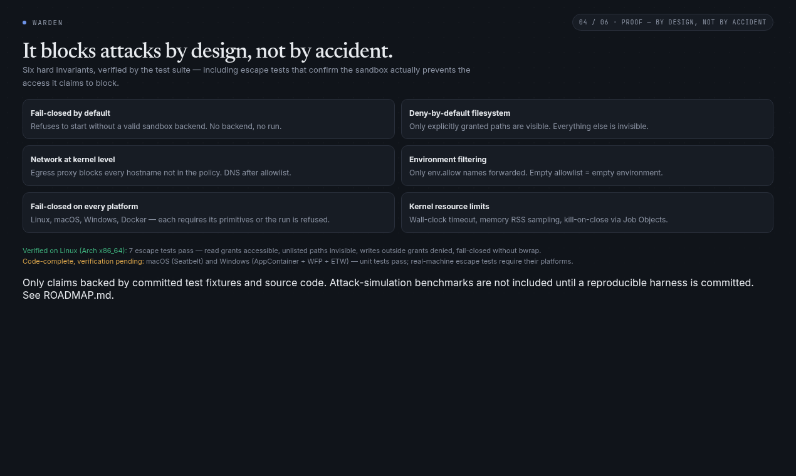
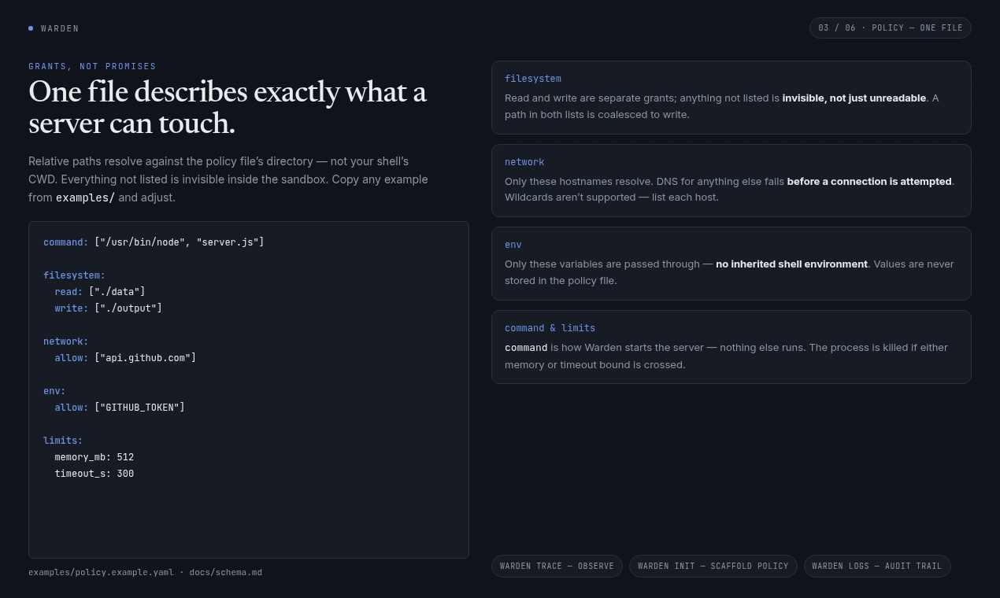

<p align="center">
  
</p>

<h1 align="center">Warden</h1>

<p align="center">
  <strong>The sandbox runtime for MCP servers</strong><br>
  Run any MCP server with only the access you grant it — nothing else exists.
</p>

<p align="center">
  <a href="https://www.npmjs.com/package/warden-sandbox-cli">
    
  </a>
  <a href="https://www.npmjs.com/package/warden-sandbox-cli">
    
  </a>
  <a href="https://github.com/Prof-bilal/Warden/actions/workflows/ci.yml">
    
  </a>
  <a href="https://github.com/Prof-bilal/Warden/releases">
    
  </a>
  <a href="LICENSE">
    
  </a>
</p>

---

> [📘 **README**](#-readme) &nbsp;·&nbsp; [🤝 **Contributing**](CONTRIBUTING.md) &nbsp;·&nbsp; [⚖️ **MIT license**](LICENSE) &nbsp;·&nbsp; [🛡️ **Security**](SECURITY.md)

---

<a id="-readme"></a>

## 💥 The Problem

MCP servers (Claude Desktop, Cursor, VS Code Copilot, and every other MCP client) run as plain processes with **full access to your machine**. The MCP spec requires zero process isolation — the default install path is *"run this script from GitHub with your user's permissions."* That server can read your SSH keys, harvest your AWS credentials, and phone any host on the internet.

**Warden fixes this.** It runs MCP servers inside OS-native sandboxes with deny-by-default access control:

| | Without Warden | With Warden |
|---|---|---|
| **Filesystem** | Entire home directory, dotfiles, SSH keys | Only paths you list — everything else is *invisible* |
| **Network** | Any host, any port, raw DNS | Only allowlisted hostnames, forced through an egress proxy |
| **Environment** | All of your shell env (secrets included) | Only the variables you name |
| **Resources** | Unbounded CPU/memory/time | Memory + wall-clock limits, killed on breach |

## 🚀 Quick Start

```bash
# Install
npm install -g warden-sandbox-cli

# Describe what the server is allowed to touch
cat > policy.yaml << 'EOF'
command: ["node", "server.js"]
filesystem:
  read: ["./data"]
  write: ["./output"]
network:
  allow: ["api.github.com"]
env:
  allow: ["GITHUB_TOKEN"]
limits:
  memory_mb: 512
  timeout_s: 300
EOF

# Run sandboxed
warden run --policy policy.yaml
```

The server sees `./data` (read), `./output` (write), `api.github.com` (network), and `GITHUB_TOKEN` (env). **Everything else does not exist** — blocked paths return "not found", not "permission denied", so the sandbox can't even be probed.

Don't want to write the policy blind? Watch the server once, unsandboxed:

```bash
warden trace -- node server.js   # records every access the server attempts
warden init                      # generates a starter policy.yaml from the trace
```

## ⚙️ How It Works

```
┌──────────────────────────────────────────────────────┐
│                    Your Machine                       │
│                                                       │
│  ┌────────────┐  stdio  ┌─────────────────────────┐  │
│  │ MCP Client │────────▶│     Warden Sandbox      │  │
│  │ (Claude…)  │         │  ┌───────────────────┐  │  │
│  └────────────┘         │  │    MCP Server     │  │  │
│                         │  └───────────────────┘  │  │
│                         │  ✓ ./data        (read) │  │
│                         │  ✓ ./output      (write)│  │
│                         │  ✓ api.github.com (net) │  │
│                         │  ✓ GITHUB_TOKEN   (env) │  │
│                         │  ✗ everything else      │  │
│                         └────────────┬────────────┘  │
│                                      │ audit (JSONL) │
│                         ┌────────────▼────────────┐  │
│                         │  ~/.local/state/warden/ │  │
│                         └─────────────────────────┘  │
└──────────────────────────────────────────────────────┘
```

Warden translates one simple YAML policy into the low-level primitives each platform actually needs. The sandboxed process talks stdio straight through to the MCP client — sandboxing is invisible to the protocol.

| OS | Enforcement | Notes |
|---|---|---|
| **Linux** | bubblewrap namespaces (user/net/pid/ipc) + cgroup-style limits | Hardware-verified |
| **macOS** | sandbox-exec / Seatbelt profiles | CI-verified; hardware proof run pending |
| **Windows** | AppContainer restricted token + WFP egress filters + ETW audit + Job Objects | CI-verified; needs elevation (admin) |
| **Fallback** | Docker containers (`--network none`, read-only root, tmpfs) | Any OS with a daemon |

**Fail-closed everywhere:** if the sandbox primitives can't be applied — bwrap missing, AppContainer refused, WFP filters unavailable, ETW session blocked — Warden **refuses to run** rather than execute unsandboxed. A plain-process fallback is never acceptable.

### Network enforcement

Egress goes through a local allowlist proxy; DNS resolution happens **after** the allowlist check, so blocked hosts never leak queries. On Linux the sandbox has no default route; on Windows WFP filters block everything but loopback to the proxy. Raw TCP/UDP is blocked by the namespace/filters (the proxy itself intercepts HTTP/HTTPS).

## ✨ Features

| | Feature | Detail |
|---|---|---|
| 🔒 | **Deny by default** | Ungranted paths are invisible (ENOENT), not "permission denied" |
| 🖥️ | **OS-native backends** | bubblewrap / Seatbelt / AppContainer — no VM, no daemon needed |
| 🌐 | **Pre-DNS network blocking** | Hostname allowlist enforced before any DNS query leaves |
| 📝 | **Policy generation** | `warden trace` + `warden init` watch a real run and write the policy |
| 📜 | **Audit trail** | Every access attempt logged as JSONL — including blocked ones |
| 👍 | **Interactive approval** | `--approve` prompts on first blocked access instead of failing |
| 🚦 | **Resource limits** | Memory (RSS-sampled) + wall-clock timeout with clean process-tree kill |
| 🔀 | **Gateway integration** | `warden gateway init/run/wrap/list` to sandbox servers in a gateway registry |
| 🩺 | **Readiness check** | `warden doctor` verifies backend, namespaces, and proxy in one command |

## 🧪 Tests & Verification

Warden is verified with **escape tests** (the sandboxed process tries to escape, and must fail), a **reproducible proof harness**, and a **compatibility matrix** against real MCP servers. Everything below is reproducible on your machine.

### Proof harness — 8/8 steps PASS

The harness (`warden-starter/warden/testdata/proof/run-proof.sh`) runs a scripted target against a real sandboxed `warden run` and checks every expected outcome:

| Step | Expected | Verdict |
|---|---|---|
| read_allowed | SUCCESS | ✅ PASS |
| write_allowed | SUCCESS | ✅ PASS |
| read_secret | BLOCKED | ✅ PASS |
| read_unlisted | BLOCKED | ✅ PASS |
| net_allowed | SUCCESS | ✅ PASS |
| net_blocked | BLOCKED | ✅ PASS |
| env_allowed | VISIBLE | ✅ PASS |
| env_denied | BLOCKED | ✅ PASS |

<p align="center">
  
</p>

Each run writes machine-checkable evidence to `evidence/<platform>/<timestamp>/` (`summary.json`, `results.jsonl`, `audit.jsonl`). Reproduce it:

```bash
cd warden-starter/warden
go build -o warden ./cmd/warden
./testdata/proof/run-proof.sh          # writes evidence/ and prints the verdict table
```

### Attack simulations — 7/7 contained, re-verified on every CI push

The attack harness (`warden-starter/warden/testdata/attacks/run-attacks.sh`) runs each attack **twice**: unsandboxed as a control (the attack must land, or the scenario is void) and sandboxed under Warden (it must be contained). Containment is confirmed **host-side** — collector request logs, vault sha256 integrity, escape-probe files — never by trusting the sandboxed process's own output.

This harness runs **in CI on every push** (the [`attack-sim` job](.github/workflows/ci.yml); docker backend on ubuntu-24.04 runners, evidence files attached as workflow artifacts). Measured results from [run 34963444394](https://github.com/Prof-bilal/Warden/actions/runs/34963444394):

| Attack | Without Warden (control) | With Warden (sandbox) | Verdict |
|---|---|---|---|
| **fs_exfil** — copy decoy SSH keys + AWS creds | EXFILTRATED | BLOCKED (0 copies) | ✅ |
| **net_exfil** — POST fingerprint to collector | Delivered (collector hit) | BLOCKED (0 hits) | ✅ |
| **env_steal** — harvest 3 planted decoy secrets | SECRETS_STOLEN | BLOCKED (0 visible) | ✅ |
| **process_spawn** — host probe + escape-probe write | FULL_SYSTEM_ACCESS | BLOCKED (no probe file) | ✅ |
| **symlink_traverse** — read through a link outside grants | PARTIAL_ACCESS | BLOCKED | ✅ |
| **ransomware** — XOR-encrypt + delete decoy docs | FILES_DESTROYED | NO_DAMAGE (vault byte-identical) | ✅ |
| **cpu_bomb** — unbounded busy-loop | ran away (649k iters/3s) | TIMEOUT_KILLED (bounded, 730k iters/5s) | ✅ |

Reproduce locally (docker backend = CI-equivalent; on a Linux desktop with bwrap you can drop `WARDEN_BACKEND` for the native backend):

```bash
cd warden-starter/warden
go build -o warden ./cmd/warden
WARDEN_BACKEND=docker bash testdata/attacks/run-attacks.sh   # exits 0 only if every control landed AND everything was contained
```

All data is decoy data the harness creates itself (fake keys, XOR "encryption", loopback-only collectors) — safe to run on your machine. Evidence format and scenario details: [testdata/attacks/README.md](warden-starter/warden/testdata/attacks/README.md).

### Policy builder output

<p align="center">
  
</p>

### Test layers

| Layer | What it proves | Where |
|---|---|---|
| **Unit + policy-engine tests** | Arg construction, parsing, env filtering, deny-by-default mounting | `go test ./...` (20 packages) |
| **Linux escape tests** | A sandboxed process cannot read ungranted paths, write outside grants, or leak env | `internal/sandbox` + bwrap (runs in CI) |
| **Windows escape tests** | AppContainer/WFP/ETW enforcement + fail-closed on missing privileges | `internal/sandbox/windows` (Windows CI job) |
| **Docker integration tests** | Container deny-by-default mounts, blocked reads | `internal/sandbox/docker` (runs when a daemon is present) |
| **Proof harness** | End-to-end behavior with a positive control, evidence files | `testdata/proof/run-proof.sh` |
| **Attack harness** | Live attack techniques (exfil, ransomware-sim, resource exhaustion) contained; verdicts from host-side artifacts the sandbox can't forge | `testdata/attacks/run-attacks.sh` (runs in CI) |
| **Compatibility matrix** | 18 real MCP servers: 14 pass, 2 conditional, 2 fail (classified) | `internal/compat` + [docs/compatibility.md](warden-starter/warden/docs/compatibility.md) |

CI runs the test matrix on Linux, macOS, and Windows runners, plus cross-builds for `windows/amd64` and `darwin/arm64`. The `attack-sim` job re-measures attack containment on every push and uploads the run's evidence (`summary.json`, per-scenario results, collector log, vault hash manifests, sandbox audit stream) as workflow artifacts. The GitHub Action that ships Warden to CI users is tested end-to-end on real runners (`.github/workflows/test-warden-action.yml`).

> **Honesty note:** every number in the attack table is re-measured in CI on each push, and each run publishes its full evidence as a workflow artifact — the table above cites one specific run. Illustrative figures elsewhere (landing page galleries) that predate the harness are labeled there and are superseded by harness output.

## 📦 Install

```bash
# npm (recommended — wraps the GitHub Releases binary)
npm install -g warden-sandbox-cli

# Direct download (Linux/macOS/Windows binaries + SHA256SUMS)
# → https://github.com/Prof-bilal/Warden/releases/latest

# From source (the Go module lives in warden-starter/warden)
cd warden-starter/warden
go build -o warden ./cmd/warden
```

## 🧰 Commands

```bash
warden run --policy policy.yaml -- node server.js   # Run sandboxed (auto-picks backend)
warden trace -- node server.js                      # Record what a server accesses (unsandboxed)
warden init                                         # Generate policy.yaml from a trace
warden logs --tail 50                               # Inspect the audit log
warden doctor                                       # Check sandbox readiness
warden gateway init|run|wrap|list                   # Gateway registry integration
warden update                                       # Update to the latest release
```

## 📚 Documentation

| | |
|---|---|
| **Docs site** | [prof-bilal.github.io/Warden](https://prof-bilal.github.io/Warden/) |
| **Quickstart** | [docs/quickstart.md](warden-starter/warden/docs/quickstart.md) |
| **Policy schema** | [docs/schema.md](warden-starter/warden/docs/schema.md) |
| **CLI reference** | [docs/cli.md](warden-starter/warden/docs/cli.md) |
| **Security & threat model** | [docs/security.md](warden-starter/warden/docs/security.md) |
| **Example policies** | [examples/](warden-starter/warden/examples/) — filesystem, GitHub, Slack, PostgreSQL, Brave Search |
| **Architecture** | [ARCHITECTURE.md](ARCHITECTURE.md) |
| **Use in CI** | [warden-action](.github/actions/warden-action/) — sandbox any build step |

## 🗺️ Status & Roadmap

Milestones M0–M8 are complete: Linux → network enforcement → trace/init/limits → macOS → Windows → distribution → real-world MCP compatibility testing (18 servers). Current status is tracked in [ROADMAP.md](ROADMAP.md), with open work items in [REMAINING_WORK.md](warden-starter/warden/REMAINING_WORK.md).

Not yet hardened against a determined local attacker — see the [threat model](warden-starter/warden/docs/security.md) for the honest limitation list (symlinks inside granted paths, HTTP/HTTPS-only proxy interception, no CPU throttling, and friends).

## 🤝 Contributing

Contributions are welcome — example policies, platform testing, docs, and code. See [CONTRIBUTING.md](CONTRIBUTING.md) for setup, repo layout, and PR guidelines.

## 🛡️ Security

Found a sandbox escape or a way to make Warden run unsandboxed? Please report it privately — see [SECURITY.md](SECURITY.md). Please don't open a public issue for exploitable behavior.

## ⚖️ License

[MIT](LICENSE) © Warden contributors
