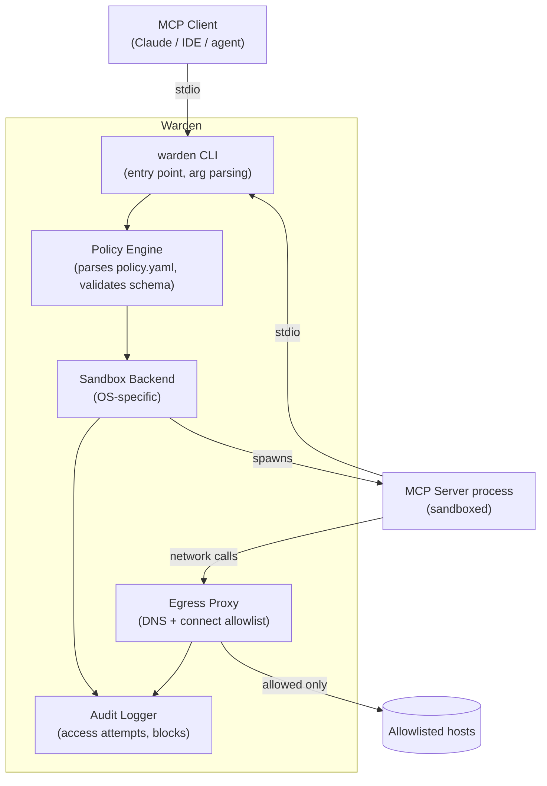

# Architecture

## Goals

1. **Transparent to the MCP client.** The AI client (Claude, an IDE, etc.)
   should not know or care that the server is sandboxed — stdio in/out
   behaves identically to running the server directly.
2. **Deny by default.** No filesystem path, network host, or env var is
   available unless the policy explicitly grants it.
3. **No root required.** Should work in a normal developer environment
   without sudo, using unprivileged namespaces where the OS supports them.
4. **Small trust boundary.** Prefer OS-native sandboxing primitives over
   a heavyweight VM/container layer, so there's less code between "policy"
   and "enforcement" to audit.
5. **Fail loud, not silent.** A blocked access attempt should be logged and
   optionally surfaced to the user immediately, not swallowed.

## Components



### 1. CLI (`warden`)

Entry point. Subcommands:

- `warden run --policy <file> -- <command...>` — run a server under a policy.
- `warden trace -- <command...>` — run **unsandboxed** but instrumented,
  logging every file/network access, to help generate a starter policy.
- `warden init [--log <file>] [--output <file>] [-- <command...>]` — scaffold
  a non-overwriting policy file from a JSONL trace log.
- `warden logs` — view/tail the audit log for a past or running session.

### 2. Policy Engine

Parses and validates the policy YAML (schema below), resolves relative
paths, and translates the declarative policy into the specific arguments
each sandbox backend needs (bind mounts, seccomp filters, network rules).
This is the one piece of logic that's shared across all platforms — keeping
it isolated from the backends makes it easier to test without needing a
Linux/macOS matrix in CI.

### 3. Sandbox Backends

One implementation per platform, behind a common interface
(`Spawn(policy) -> (pid, stdio pipes, error)`):

- **Linux — bubblewrap (`bwrap`).** Unprivileged user namespaces, bind-mount
  only the declared paths, drop unneeded capabilities. Mature, used by
  Flatpak in production for years, no root needed.
  - **Runtime base:** `/usr` and `/lib64` are explicitly bound read-only.
    (Critical: on merged-`/usr` systems like Arch, `/lib64` is a symlink
    into `/usr/lib` and bwrap does not follow symlinks across bind mounts,
    so both must be bound explicitly or all dynamically-linked binaries fail.)
  - **Pseudo-fs:** `/dev`, `/proc`, and a fresh `/tmp` (tmpfs) are mounted.
  - **Env passthrough:** Only names in `env.allow` are forwarded from the
    parent environment. Empty allowlist ⇒ empty environment.
- **macOS — `sandbox-exec` (Seatbelt profiles).** Apple-provided, deprecated
  but functional and still the most practical unprivileged option; profile
  is generated from the policy. Network is deny-by-default except loopback
  TCP to the egress proxy bridge (and its Unix socket). Structured file-deny
  audit events are Linux/`strace`-only; Seatbelt still enforces file denies
  as EPERM, and the egress proxy records network allow/deny decisions.
- **Fallback — Docker.** Used when the native backend for the current OS is
  unavailable, or explicitly requested via `--backend docker`. Preference
  order for `--backend auto` (the default):
  - Linux: `bwrap` → Docker → fail closed
  - macOS: `sandbox-exec` → Docker → fail closed
  - other: Docker → fail closed
  Heavier than native primitives, but works anywhere a Docker daemon is
  usable. Containers run `--network none` with the same loopback proxy-bridge
  pattern as Linux; host paths are bind-mounted deny-by-default. The image
  defaults to `alpine:3.20` (override with `WARDEN_DOCKER_IMAGE`). The
  in-container proxy bridge must be a Linux ELF `warden` binary: on Linux
  hosts the current executable is used; on macOS/Windows set
  `WARDEN_DOCKER_BRIDGE` to a cross-compiled Linux binary (macOS auto-detect
  still prefers Seatbelt when `sandbox-exec` is present).
- **Windows — M5.** An AppContainer backend will use a restricted token,
  filesystem capabilities, Windows Filtering Platform rules, ETW audit
  events, and a Job Object for process-tree limits. Until all of those
  enforcement primitives are installed successfully, Warden refuses to run;
  it never falls back to a plain Windows process.

### 4. Egress Proxy

Filesystem restriction is handled by the sandbox backend directly (bind
mounts), but network restriction uses a small local proxy. The sandbox gets a
fresh network namespace with no external route. A loopback bridge is its only
network listener; it forwards HTTP proxy traffic over a private Unix socket to
the host-side proxy. `HTTP_PROXY`, `HTTPS_PROXY`, and `ALL_PROXY` point to that
bridge. Direct connects and direct DNS have no route; the host-side proxy
checks `network.allow` before it performs any DNS lookup or opens an upstream
connection. It logs every allow/deny decision.

### 5. Audit Logger

Structured (JSON-lines) log of every access attempt: timestamp, type
(file/network), action, resource, allowed/blocked, and reason. On Linux,
Warden runs `strace -f` outside the sandbox to capture file and low-level
network syscalls without granting the target write access to the evidence.
The egress proxy records its hostname decisions separately. `warden logs`
prints the persistent JSONL stream.

### 6. Limits and trace mode

`trace` runs a command without sandbox restrictions under external `strace`
instrumentation, so the observed process cannot edit its own trace. `init`
uses only successful observed accesses to produce a conservative starter
policy; it omits runtime paths already provided by the Linux backend.

For a sandboxed Linux run, Warden samples the resident memory of the launcher
and its descendants every 25 ms and enforces `limits.memory_mb`. It also
enforces `limits.timeout_s` with a wall-clock timer. On a breach it signals
the dedicated process group with SIGTERM and escalates to SIGKILL after 750 ms
if necessary; the breach is a structured audit event.

## Policy schema (draft)

```yaml
command: ["/usr/bin/node", "server.js"] # required: use an absolute executable path

filesystem:
  read: ["./data"]               # read-only bind mounts
  write: ["./output"]            # read-write bind mounts
  # everything else is invisible inside the sandbox, not just unreadable

network:
  allow: ["api.github.com"]      # hostnames the server may connect to
  # DNS resolution for non-allowlisted hosts fails; no leakage via DNS

env:
  allow: ["GITHUB_TOKEN"]        # only these vars are passed through
  # (values come from the parent environment, not stored in the policy file)

limits:
  memory_mb: 512
  timeout_s: 300
  # process is killed if either limit is exceeded
```

Open question for M2/M3: should the policy support a "learn mode" flag that
runs `trace` automatically on first launch and asks the user to approve a
generated policy interactively? Leaning yes — it's a much lower-friction
onboarding path than asking people to hand-write YAML on day one.

## Non-goals (for now)

- **Agent identity / audit-trail-of-who-asked.** Related but separate
  problem (see the MCP ecosystem's "agent identity" gap) — Warden sandboxes
  *what a server can do*, not *who's acting through the client*. Worth a
  follow-on project, not this one.
- **Multi-tenant / server-side deployment.** Warden targets a developer
  running MCP servers locally, not a hosted gateway serving many users.
