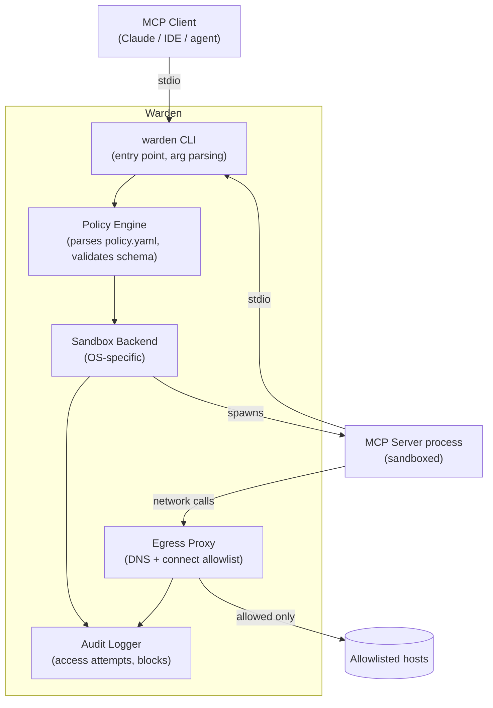

# Architecture

## Goals

1. **Transparent to the MCP client.** The AI client (Claude, an IDE, etc.)
   should not know or care that the server is sandboxed — stdio in/out
   behaves identically to running the server directly.
2. **Deny by default.** No filesystem path, network host, or env var is
   available unless the policy explicitly grants it.
3. **No root required.** Should work in a normal developer environment
   without sudo, using unprivileged namespaces where the OS supports them.
4. **Small trust boundary.** Prefer OS-native sandboxing primitives over
   a heavyweight VM/container layer, so there's less code between "policy"
   and "enforcement" to audit.
5. **Fail loud, not silent.** A blocked access attempt should be logged and
   optionally surfaced to the user immediately, not swallowed.

## Components



### 1. CLI (`warden`)

Entry point. Subcommands:

- `warden run --policy <file> -- <command...>` — run a server under a policy.
- `warden trace -- <command...>` — run **unsandboxed** but instrumented,
  logging every file/network access, to help generate a starter policy.
- `warden init` — scaffold a policy file from a trace log or from
  interactive prompts.
- `warden logs` — view/tail the audit log for a past or running session.

### 2. Policy Engine

Parses and validates the policy YAML (schema below), resolves relative
paths, and translates the declarative policy into the specific arguments
each sandbox backend needs (bind mounts, seccomp filters, network rules).
This is the one piece of logic that's shared across all platforms — keeping
it isolated from the backends makes it easier to test without needing a
Linux/macOS matrix in CI.

### 3. Sandbox Backends

One implementation per platform, behind a common interface
(`Spawn(policy) -> (pid, stdio pipes, error)`):

- **Linux — bubblewrap (`bwrap`).** Unprivileged user namespaces, bind-mount
  only the declared paths, drop unneeded capabilities. Mature, used by
  Flatpak in production for years, no root needed.
  - **Runtime base:** `/usr` and `/lib64` are explicitly bound read-only.
    (Critical: on merged-`/usr` systems like Arch, `/lib64` is a symlink
    into `/usr/lib` and bwrap does not follow symlinks across bind mounts,
    so both must be bound explicitly or all dynamically-linked binaries fail.)
  - **Pseudo-fs:** `/dev`, `/proc`, and a fresh `/tmp` (tmpfs) are mounted.
  - **Env passthrough:** Only names in `env.allow` are forwarded from the
    parent environment. Empty allowlist ⇒ empty environment.
- **macOS — `sandbox-exec` (Seatbelt profiles).** Apple-provided, deprecated
  but functional and still the most practical unprivileged option; profile
  is generated from the policy.
- **Fallback — Docker.** Used when neither of the above is available, or
  explicitly requested via `--backend docker`. Heavier, but works everywhere
  Docker does, and is a reasonable v1 for macOS/Windows before a native
  backend exists.
- **Windows — deferred.** Likely AppContainer or a WSL2 delegation; not in
  scope for the first milestones (see Roadmap).

### 4. Egress Proxy

Filesystem restriction is handled by the sandbox backend directly (bind
mounts), but network restriction needs its own layer: a small local proxy
that the sandboxed process is forced to route through (via `HTTP_PROXY`/
`HTTPS_PROXY` env injection plus a network namespace that blocks direct
egress). The proxy checks the destination host against the policy's
`network.allow` list before permitting the connection, and logs everything,
allowed or not.

### 5. Audit Logger

Structured (JSON-lines) log of every access attempt: timestamp, type
(file/network/env), resource, and allowed/blocked. This is what `trace`
mode and `warden logs` both read from — it's the same logger, just running
in "observe and allow everything" mode vs. "observe and enforce" mode.

## Policy schema (draft)

```yaml
command: ["node", "server.js"]   # required: how to start the MCP server

filesystem:
  read: ["./data"]               # read-only bind mounts
  write: ["./output"]            # read-write bind mounts
  # everything else is invisible inside the sandbox, not just unreadable

network:
  allow: ["api.github.com"]      # hostnames the server may connect to
  # DNS resolution for non-allowlisted hosts fails; no leakage via DNS

env:
  allow: ["GITHUB_TOKEN"]        # only these vars are passed through
  # (values come from the parent environment, not stored in the policy file)

limits:
  memory_mb: 512
  timeout_s: 300
  # process is killed if either limit is exceeded
```

Open question for M2/M3: should the policy support a "learn mode" flag that
runs `trace` automatically on first launch and asks the user to approve a
generated policy interactively? Leaning yes — it's a much lower-friction
onboarding path than asking people to hand-write YAML on day one.

## Non-goals (for now)

- **Agent identity / audit-trail-of-who-asked.** Related but separate
  problem (see the MCP ecosystem's "agent identity" gap) — Warden sandboxes
  *what a server can do*, not *who's acting through the client*. Worth a
  follow-on project, not this one.
- **Multi-tenant / server-side deployment.** Warden targets a developer
  running MCP servers locally, not a hosted gateway serving many users.
